# Scientific Manuscript Processing Pipeline

## Overview

This pipeline processes scientific manuscripts, extracting and organizing information about figures, panels, captions, and associated data files. It employs AI-driven analysis and structured data handling to produce a comprehensive JSON representation of the manuscript's content.

## Workflow

```mermaid
flowchart TD
    %% Main Process Flow
    A[Input ZIP File] --> B[Extract ZIP Contents]
    B --> C[Parse XML Structure]
    C --> D[Extract Figure Captions]
    D --> E[Detect Panels in Figures]
    E --> F[Match Panel Captions]
    F --> G[Assign Panel Source Data]
    G --> H[Process EV Materials]
    H --> I[Final Processing and Cleanup]
    I --> J[Output JSON]

    %% Subprocesses
    B --> B1[Unzip files]
    B --> B2[Create structured directory]
    C --> C1[Identify figures & appendices]
    C --> C2[Build manuscript structure]
    D --> D1[Use AI to analyze text]
    D --> D2[Extract captions]
    E --> E1[Use YOLOv10 for detection]
    E --> E2[Locate individual panels]
    F --> F1[Match captions to panels]
    F --> F2[AI-driven analysis]
    G --> G1[Analyze file structures]
    G --> G2[Associate data with panels]
    H --> H1[Identify EV materials]
    H --> H2[Assign to figures/appendix]
    I --> I1[Normalize file paths]
    I --> I2[Remove duplicates]

    %% Error Handling Paths with Exception Details
    B -.- BE1[Invalid ZIP file]
    BE1 --> BE1D[Log error, Exception, stop process]
    B -.- BE2[Extraction failure]
    BE2 --> BE2D[Log error, Exception, stop process]
    C -.- CE1[Missing XML file]
    CE1 --> CE1D[Log error, Exception, stop process]
    C -.- CE3[Missing information in XML]
    CE3 --> CE3D[If no PDF and DOCX, log error, exception, stop process]
    C -.- CE2[Malformed XML]
    CE2 --> CE2D[Log error, Exception, stop process]
    D -.- DE1[No caption found]
    DE1 --> DE1D[Mark as 'Caption not found', continue]
    D -.- DE2[AI model error]
    DE2 --> DE2D[Log error, retry or use fallback method]
    E -.- EE1[Panel detection failure]
    EE1 --> EE1D[Log error, proceed with available panels]
    F -.- FE1[Matching failure]
    FE1 --> FE1D[Leave caption empty, continue to next]
    G -.- GE1[Unassigned files]
    GE1 --> GE1D[Add to 'non_associated_sd_files' list]
    H -.- HE1[EV processing error]
    HE1 --> HE1D[Log error, skip problematic EV item]
    I -.- IE1[Unassigned files remain]
    IE1 --> IE1D[Add to 'non_associated_sd_files' in output]

    %% Style Definitions
    classDef process fill:#EFA22A,stroke:#FFFFFF,stroke-width:2px,color:#000000,font-weight:bold;
    classDef subProcess fill:#BBC33C,stroke:#FFFFFF,stroke-width:1px,color:#000000,font-weight:bold;
    classDef exception fill:#E86236,stroke:#FFFFFF,stroke-width:1px,color:#FFFFFF,font-weight:bold;
    classDef exceptionDetail fill:#87CEFA,stroke:#000000,stroke-width:1px,color:#000000,font-weight:normal;

    class A,B,C,D,E,F,G,H,I,J process;
    class B1,B2,C1,C2,D1,D2,E1,E2,F1,F2,G1,G2,H1,H2,I1,I2 subProcess;
    class BE1,BE2,CE1,CE2,DE1,DE2,EE1,FE1,GE1,HE1,IE1,CE3 exception;
    class BE1D,BE2D,CE1D,CE2D,DE1D,DE2D,EE1D,FE1D,GE1D,HE1D,IE1D,CE3D exceptionDetail;
```

### 1. Extract ZIP Contents

- **Input**: ZIP file containing manuscript files
- **Process**:
  - Unzip files into a structured directory
  - Create a temporary working directory
- **Exception Handling**:
  - Invalid ZIP file: Log error and stop process
  - Extraction failure: Log error and stop process
- **Output**: Structured directory with extracted files

### 2. Parse XML Structure

- **Input**: Extracted files, primarily the XML file
- **Process**:
  - Identify figures, appendices, and associated files
  - Build initial manuscript structure
- **Exception Handling**:
  - Missing XML file: Log error, continue with partial information
  - Malformed XML: Log error, attempt to parse valid sections
- **Output**: Initial `ZipStructure` object with basic manuscript information

### 3. Extract Figure Captions

- **Input**: DOCX or PDF file from extracted contents
- **Process**:
  - Use AI (OpenAI's GPT model) to analyze text and extract captions
  - Associate captions with corresponding figures
- **Exception Handling**:
  - No caption found: Mark as "Figure caption not found", continue processing
  - AI model error: Log error, retry or use fallback method (e.g., regex-based extraction)
- **Output**: Updated `ZipStructure` with figure captions

### 4. Detect Panels in Figures

- **Input**: Figure image files
- **Process**:
  - Use YOLOv10 object detection to identify individual panels
  - Locate and record bounding boxes for each panel
- **Exception Handling**:
  - Panel detection failure: Log error, proceed with available panels
- **Output**: `ZipStructure` updated with panel information for each figure

### 5. Match Panel Captions

- **Input**: Figures with detected panels and full figure captions
- **Process**:
  - Use AI to match specific parts of the caption to individual panels
- **Exception Handling**:
  - Matching failure: Leave panel caption empty, continue to next panel
- **Output**: `ZipStructure` with panel-specific captions

### 6. Assign Panel Source Data

- **Input**: Source data files, figures with panels
- **Process**:
  - Analyze file names and structures
  - Associate source data files with specific panels
- **Exception Handling**:
  - Unassigned files: Add to 'non_associated_sd_files' list
- **Output**: `ZipStructure` with source data assignments

### 7. Process EV Materials

- **Input**: Extended View (EV) materials identified in earlier steps
- **Process**:
  - Identify EV figures, tables, and datasets
  - Assign EV materials to appropriate figures or appendix
- **Exception Handling**:
  - EV processing error: Log error, skip problematic EV item
- **Output**: `ZipStructure` with processed EV materials

### 8. Final Processing and Cleanup

- **Input**: Fully processed `ZipStructure`
- **Process**:
  - Normalize file paths relative to the manuscript structure
  - Remove duplicate entries
  - Categorize any remaining unassigned files
  - Clean up temporary extracted files
- **Exception Handling**:
  - Unassigned files remain: Add to 'non_associated_sd_files' in final output
- **Output**: Finalized `ZipStructure` ready for JSON conversion

## Output JSON Structure

The final output is a JSON file with the following key components:

- `manuscript_id`: Unique identifier for the manuscript
- `xml`: Path to the XML file
- `docx`: Path to the DOCX file
- `pdf`: Path to the PDF file
- `appendix`: List of appendix files
- `figures`: Array of figure objects, each containing:
  - `figure_label`: Label of the figure (e.g., "Figure 1")
  - `img_files`: List of image files for the figure
  - `sd_files`: List of source data files associated with the figure
  - `figure_caption`: Full caption of the figure
  - `panels`: Array of panel objects, each containing:
    - `panel_label`: Label of the panel (e.g., "A", "B")
    - `panel_caption`: Caption specific to the panel
    - `panel_bbox`: Bounding box coordinates of the panel
    - `sd_files`: List of source data files associated with the panel
- `non_associated_sd_files`: List of source data files not associated with any specific figure or panel

## Important Notes for Developers

1. **AI Dependencies**: The system relies on OpenAI's GPT for text analysis and YOLOv10 for image processing. Ensure these dependencies are properly set up and API keys are configured.

2. **Error Handling**: The system is designed to be resilient. Most errors will not halt the entire process but may result in partial or missing data. Always check the logs for warnings or errors.

3. **File Paths**: All file paths in the output JSON are relative to the manuscript structure. When using this data, you may need to reconstruct full paths based on your file system.

4. **Source Data Association**: The 'non_associated_sd_files' list may contain important data that couldn't be automatically associated. Consider implementing a manual review process for these files.

5. **EV Materials**: Extended View materials are processed separately and may require special handling in downstream applications.

6. **Performance Considerations**: Processing large manuscripts with many figures can be time-consuming, especially the AI-driven steps. Consider implementing progress tracking or batch processing for large datasets.

7. **Output Validation**: While the system attempts to handle all cases, it's recommended to implement validation checks on the output JSON to ensure all expected data is present and correctly formatted.

8. **Customization**: The pipeline is modular. If you need to modify or extend functionality (e.g., supporting additional file formats or implementing different AI models), you can focus on specific modules without overhauling the entire system.
