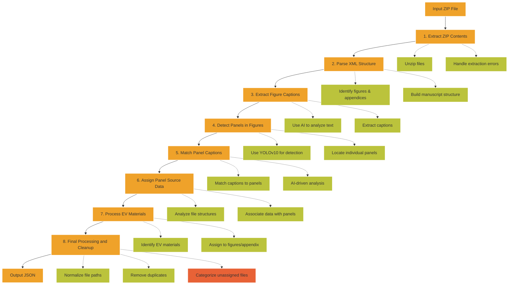

# Scientific Manuscript Processing Pipeline

## Overview

This pipeline processes scientific manuscripts, extracting and organizing information about figures, panels, captions, and associated data files. It employs AI-driven analysis and structured data handling to produce a comprehensive representation of the manuscript's content.

## Workflow

Detailed Steps

1. Extract ZIP Contents
   Purpose: Extracts the contents of the input ZIP file to a temporary directory.
   Process:

Unzips the input file into a structured directory
Prepares files for further analysis

Error Handling:

If the ZIP file is invalid or extraction fails, the process stops and reports the error.

2. Parse XML Structure
   Purpose: Reads the XML file to understand the manuscript structure.
   Process:

Identifies figures, appendices, and associated files
Builds the initial manuscript structure

Error Handling:

If the XML file is missing or malformed, it logs an error and tries to continue with partial information.

3. Extract Figure Captions
   Purpose: Uses AI (OpenAI's GPT model) to extract figure captions from the manuscript text.
   Process:

Analyzes DOCX or PDF content
Extracts detailed captions for each figure

Error Handling:

If caption extraction fails for a figure, it marks the caption as "Figure caption not found" and continues with the next figure.

4. Detect Panels in Figures
   Purpose: Uses object detection (YOLOv10) to identify individual panels within each figure image.
   Process:

Analyzes figure images
Detects and locates individual panels

Error Handling:

If panel detection fails for a figure, it logs an error and moves to the next figure.

5. Match Panel Captions
   Purpose: Uses AI to match detected panels with specific parts of the figure caption.
   Process:

Analyzes full figure captions
Assigns relevant caption text to each detected panel

Error Handling:

If matching fails for a panel, it leaves the panel caption empty and continues.

6. Assign Panel Source Data
   Purpose: Uses AI to assign source data files to specific panels.
   Process:

Analyzes file names and structures
Associates raw data with specific figure components

Error Handling:

If assignment fails, it marks files as unassigned and continues.

7. Process EV Materials
   Purpose: Identifies and processes Extended View (EV) materials.
   Process:

Recognizes EV content
Assigns EV materials to appropriate figures or appendix

Error Handling:

If EV processing fails, it logs an error and continues with the rest of the process.

8. Final Processing and Cleanup
   Purpose: Ensures consistency and removes redundant information.
   Process:

Normalizes file paths relative to the manuscript structure
Removes duplicate entries
Categorizes unassigned files
Cleans up temporary extracted files

Error Handling:

Logs any errors during this process but attempts to complete as much as possible.

Key Benefits

Automation: Reduces manual effort in processing complex scientific manuscripts.
AI-Driven Analysis: Leverages advanced AI models for understanding and extracting information from scientific content.
Structured Output: Produces a well-organized JSON representation of the manuscript structure.
Comprehensive Processing: Handles various components including figures, panels, captions, and associated data files.
Error Resilience: Designed to continue processing even when encountering partial failures, ensuring maximum data extraction.

This pipeline demonstrates a sophisticated approach to scientific manuscript processing, enhancing the accessibility and usability of complex research data.
